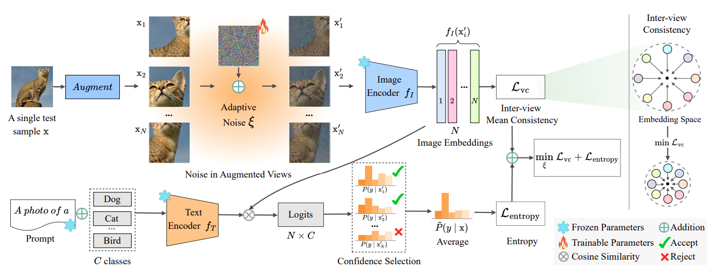
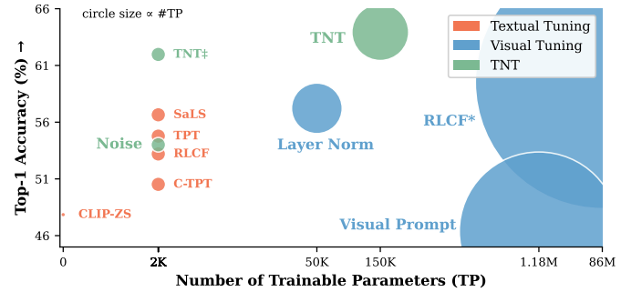

### Noise is an efficient learner for zero-shot vision-language models (ICCVxCLVL 2025)
[Raza Imam](https://razaimam45.github.io/), Asif Hanif, Jian Zhang, Khaled Waleed Dawoud, Yova Kementchedjhieva, Mohammad Yaqub
Mohamed Bin Zayed University of Artificial Intelligence

[](https://arxiv.org/abs/2502.06019)

This repository provides the official PyTorch implementation of our TTL paper:    

> Noise is an efficient learner for zero-shot vision-language models      
> Authors: *Raza Imam, Asif Hanif, Jian Zhang, Khaled Waleed Dawoud, Yova Kementchedjhieva, Mohammad Yaqub*  

<p align = "center">

</p>
<p align = "center">
Working of our Noise Adaptation Method: TNT.
</p>

For more details, please check out our [<ins>**paper**</ins>](https://arxiv.org/abs/2502.06019). 

## Overview
TNT is a test-time adaptation method for zero-shot vision–language models that learns input-space noise per sample, aligns multi-view embeddings, and uses temperature-scaled voting over confident views to improve generalization and calibration without updating model weights.
Across ImageNet distribution shifts, TNT improves OOD top-1 accuracy by +7.38 points over zero-shot CLIP, and yields +0.80 points on cross-dataset benchmarks, with experiments primarily on CLIP ViT-B/16.

### Key ideas
- Learn a bounded image-space noise map ξ and update it at test time using entropy minimization on top-K confident augmentations to reduce uncertainty for the current sample.
- Enforce inter-view consistency by minimizing pairwise distances between embeddings of the selected confident views to stabilize features across augmentations.
- At inference, average temperature-scaled logits over the top-K views with the learned noise to form the final prediction, improving accuracy and calibration without modifying VLM weights.

### What’s new
- First noise-adaptation strategy for test-time tuning of VLMs that operates directly in the visual input space under a black-box vision encoder assumption.
- Synergizes with CoOp-initialized prompts while keeping the visual encoder frozen, outperforming strong TTA baselines like TPT, C-TPT, SaLS, and RLCF on natural and cross-dataset shifts.
- Uses a simple, efficient setup (single-step optimization by default) and reports runs on a single NVIDIA A6000 48GB GPU for all experiments.


### Repository structure
```
- clip/
- data/
- scripts/
- utils/: shared utilities
- tnt.py: main entrypoint (CLI) to run TNT inference and test-time optimization
- params.py: default hyperparameters and configuration used in experiments
```

### Installation
- The paper evaluates TNT on CLIP backbones (e.g., ViT-B/16) and does not require training the encoder; use any standard PyTorch CLIP implementation and ensure access to GPU for augmentation-heavy test-time optimization as reported in the paper.
- The code repository is linked from the arXiv page; install the repo and its dependencies as indicated there to match the reported environment.

### Datasets 

We suggest downloading all datasets to a root directory (`${DATA_ROOT}`), and renaming the directory of each dataset as suggested in `${ID_to_DIRNAME}` in `./data/datautils.py`. This would allow you to evaluate multiple datasets within the same run.     
If this is not feasible, you could evaluate different datasets separately, and change the `${DATA_ROOT}` accordingly in the bash script.

For out-of-distribution generalization, we consider 5 datasets:

* [ImageNet](https://image-net.org/index.php) 
* [ImageNet-A](https://github.com/hendrycks/natural-adv-examples)
* [ImageNet-R](https://github.com/hendrycks/imagenet-r)
* [ImageNet-V2](https://s3-us-west-2.amazonaws.com/imagenetv2public/imagenetv2-matched-frequency.tar.gz)
* [ImageNet-Sketch](https://github.com/HaohanWang/ImageNet-Sketch)

For cross-datasets generalization, we consider 10 datasets:
* [Flower102](https://www.robots.ox.ac.uk/~vgg/data/flowers/102/102flowers.tgz)
* [DTD](https://www.robots.ox.ac.uk/~vgg/data/dtd/download/dtd-r1.0.1.tar.gz)
* [OxfordPets](https://www.robots.ox.ac.uk/~vgg/data/pets/data/images.tar.gz)
* [StanfordCars](https://ai.stanford.edu/~jkrause/cars/car_dataset.html)
* [UCF101](https://drive.google.com/file/d/10Jqome3vtUA2keJkNanAiFpgbyC9Hc2O/view?usp=sharing)
* [Caltech101](http://www.vision.caltech.edu/Image_Datasets/Caltech101/101_ObjectCategories.tar.gz)
* [Food101](http://data.vision.ee.ethz.ch/cvl/food-101.tar.gz)
* [SUN397](http://vision.princeton.edu/projects/2010/SUN/SUN397.tar.gz)
* [Aircraft](https://www.robots.ox.ac.uk/~vgg/data/fgvc-aircraft/archives/fgvc-aircraft-2013b.tar.gz)
* [EuroSAT](http://madm.dfki.de/files/sentinel/EuroSAT.zip)

For cross-dataset generalization, we adopt the same train/val/test splits as CoOp. Please refer to [this page](https://github.com/KaiyangZhou/CoOp/blob/main/DATASETS.md#how-to-install-datasets), and look for download links of `split_zhou_${dataset_name}.json`, and put the json files under `./data/data_splits/`.

### Pretrained models and prompts
- Zero-shot CLIP ViT-B/16 is the primary backbone, evaluated alone and with CoOp-initialized 4-shot prompts used only for initialization in the stronger TNT variant.
- TNT preserves the encoder weights; TNT* uses a hand-crafted “a photo of a {CLASS}” prompt, while TNT uses CoOp-initialized prompts for additional gains.

### Quick start
Run TNT on an OOD split (illustrative CLI mirroring paper defaults and the provided entrypoint):[4]
```
python tnt.py \
  --dataset imagenet_a \
  --backbone vit_b16 \
  --num_views 64 \
  --topk 6 \
  --epsilon 0.0039 \
  --lr 1e-3 \
  --tau 7e-3 \
  --steps 1 \
  --prompt coop_4shot \
  --save_dir runs/tnt_imagenet_a
```
- Paper defaults: N=64 augmentations per image, ε=1/255 for noise bounds, learning rate 1e−3, temperature τ=7e−3, and single-step optimization unless otherwise noted.
- TNT* uses the hand-crafted prompt; TNT uses CoOp-initialized weights, with both variants keeping the visual encoder frozen during test-time tuning.

### Main results (ViT-B/16)
#### Quantitative Results
<div align="center">

| Setting | CLIP | TNT* | TNT |
|---|---|---|---|
| ImageNet (in-domain) | 67.41  | 70.27  | 72.06  |
| ImageNet-A (OOD) | 47.85  | 61.87  | 63.93  |
| OOD average (IN-A/V2/R/K) | 57.21  | 62.63  | 64.59 (+7.38)  |
| Cross-dataset average (10 sets) | 63.68  | 64.07  | 64.48 (+0.80)  |

</div>
<br />

#### Qualitative Results

<p align = "center">

</p>
<p align = "center">
</p>

#### Computation Results

<p align = "center">

</p>
<p align = "center">
</p>


### Reproducibility notes
- All reported ablations and efficiency numbers use the same backbone across methods, one optimization step by default, and a single A6000 48GB GPU; TNT attains strong accuracy–time–memory trade-offs versus prior TTA baselines under these settings.
- Increasing steps and augmentations typically improves both accuracy and Expected Calibration Error, with diminishing returns past N≈64 and modest extra memory/time costs as analyzed in the paper.

### Citation
If you find this work useful, please cite the arXiv version below (ICCVxCLVL 2025 listing appears on the author’s page):[2][1]
```
@article{imam2025tnt,
  title   = {Noise is an Efficient Learner for Zero-Shot Vision-Language Models},
  author  = {Imam, Raza and Hanif, Asif and Zhang, Jian and Dawoud, Khaled Waleed and Kementchedjhieva, Yova and Yaqub, Mohammad},
  journal = {arXiv:2502.06019},
  year    = {2025}
}
```

### Contact
For questions and collaborations, use the MBZUAI author contact listed on the arXiv page and author homepage, which also notes the ICCVxCLVL 2025 acceptance.[2]